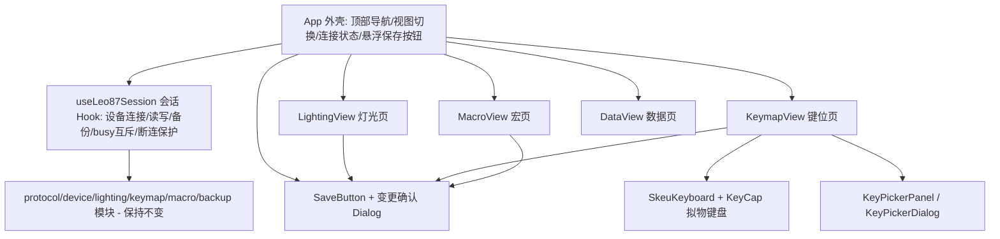

## Product Overview

对现有 Leo87 网页驱动（React 单体单页应用，深绿配色）进行 UI 重构：在保留全部设备通信与数据保护逻辑的前提下，重新组织页面结构并整体切换视觉风格。重构后为一个浅色、以橙色为主色调的现代化工具型网页，通过顶部导航在「灯光」「键位」「宏」「数据」四个视图之间切换，其中键位页提供拟物化可视化键盘与多种交互式改键方式，各编辑页提供悬浮在右上角的保存按钮，点击后弹窗确认本次将要修改的内容。

## Core Features

- **页面拆分**：将原单页拆为四个独立视图——灯光动画页、键盘键位配置页、宏配置页、数据备份页；顶部提供导航切换。
- **可视化交互式改键（键位页）**：拟物化键盘上点击选中按键后，可通过以下方式更改键位，禁止仅用下拉选择：
- 可搜索的可视化键位面板，点击目标键完成绑定；
- 弹出拟物化小键盘，点击目标键完成绑定；
- 在拟物键盘上拖拽一个键到另一个键，互换两者的键位绑定。
- **拟物化键盘**：键帽具备立体感（渐变、内阴影、底边投影），区分普通/选中/已更改/不可编辑等状态，并按真实物理布局展示（键宽、间隙、侧键滚轮区）。
- **灯光页**：灯效选择、亮度与速度档位、颜色与 RGB 轮换；并承载逐键颜色（按 record 索引取色、预设色板、颜色表导入导出与差异预览）。
- **宏页**：M1–M10 槽位选择、实时录制（含按键监视与输入法提示）、动作延时编辑、清空与保存，以及宏触发绑定入口。
- **数据页**：当前配置下载、首次备份下载、从浏览器备份或导入文件恢复、待写入差异预览与完整写入验证、128 条原始记录查看。
- **悬浮保存与确认弹窗**：每个可编辑页面右上角悬浮保存按钮，点击后弹窗列出本次将要修改的全部内容（如键位差异、灯光参数、宏动作、颜色差异），确认后才执行写入。
- **配色与提示**：整体浅色主题，橙色为主色调；保留连接状态、操作成功/失败提示与设备断开保护反馈。

## Visual Effect

浅色背景搭配橙色主色调，卡片式分区、留白充足、层次清晰；键帽拟物立体、有按压微动效与悬停反馈；保存按钮固定悬浮于右上角，确认弹窗居中弹出并遮罩背景；整体风格现代、精致、易读，同时保证关键状态（已更改/可编辑/未连接）一目了然。

## Tech Stack

- **框架/构建**：沿用 React 19 + TypeScript 5.9 + Vite 7（不改变应用运行时）。
- **样式**：新增 **Tailwind CSS v4**（使用 `@tailwindcss/vite` 插件，无需 PostCSS 配置），以 `src/index.css` 作为唯一 CSS 入口，替换现有 `src/styles.css`。
- **组件库**：**shadcn/ui**（按用户偏好），依赖：`class-variance-authority`、`clsx`、`tailwind-merge`、`lucide-react`、`tw-animate-css`，以及所需 Radix 基础组件（dialog、select、slider、switch、tabs、tooltip、dropdown-menu、popover、scroll-area、separator）。生成 `components.json` 并在 `vite.config.ts`、`tsconfig.app.json` 配置 `@/*` 别名。
- **状态管理**：不引入新状态库，继续使用 React Hooks；将跨页共享的设备会话状态收敛为自定义 Hook（或 Context）。
- **图标/通知**：`lucide-react` 图标；操作提示沿用现有 `notice` 机制（可选升级为 shadcn toast）。

## Implementation Approach

以「**外壳 + 会话层 + 视图层 + 复用组件层**」重构单体 `App.tsx`，设备协议/备份模块保持不变：

1. **会话层抽取**：把 `App.tsx` 中设备连接、读取、写入、断连监听、备份状态与全部工作流函数（`connect`/`reread`/`disconnect`/`operate`/`acceptRead`/`apply*`/`stage*`/`saveSelectedMacro`/`applyKeymap` 等）抽取为 `useLeo87Session` 自定义 Hook，对外暴露 state 与操作方法。**关键决策**：会话层集中承载 `operate()` 的 busy 互斥与「写入失败即断开设备」的安全语义，保证多页面切换后行为与现状完全一致，避免逻辑分散导致回归。
2. **视图层拆分**：`App.tsx` 退化为外壳，仅负责顶部导航、视图切换（`view: 'lighting' | 'keymap' | 'macro' | 'data'`）、连接状态、全局提示与右上角悬浮保存按钮。四个视图组件（`LightingView`/`KeymapView`/`MacroView`/`DataView`）从 Hook 取数，纯展示 + 事件回调。
3. **保存按钮与确认弹窗**：由于各页待修改内容不同，由各视图向保存按钮提供「变更摘要」（灯光参数、`diffRecords` 结果、`diffColorMap` 结果、宏 draft 等），保存按钮统一渲染为右上角悬浮 FAB，点击弹出 shadcn `Dialog` 列出待修改内容，确认后调用对应写入方法。**关键决策**：复用现有差异计算函数（`diffRecords`/`diffColorMap`）作为唯一「变更来源」，避免重复实现导致展示与写入不一致。
4. **拟物键盘组件**：抽取 `SkeuKeyboard` + `KeyCap`，复用于键位页与键位选择弹窗；键位数据沿用 `KEY_ROWS`（含 `width`/`gap`）与侧键（83/84/85/87）。支持原生 HTML5 拖拽实现键位互换（交换两 record 的语义），并保留点击选中态。**关键决策**：拖拽仅交换界面绑定并写入草稿，实际写盘仍走「保存→确认→完整七段写入回读」既有安全链路。
5. **交互动效与可访问性**：遵循 shadcn 的可访问性约定（Dialog/Select 等使用 Radix 语义与 ARIA），键帽提供悬停/按下/选中视觉反馈。

**性能与可靠性**：键位差异继续用 `useMemo` 基于 `keymap`/`edits`/`restore` 派生，保证 O(128) 计算仅在依赖变化时触发；拟物键盘约 95 个键位，`KeyCap` 使用 `React.memo` 减少无关重渲染；颜色差异沿用 `diffColorMap` 增量比较。设备写入仍为分段串行 + 回读校验，未引入额外 I/O。所有新增仅为 UI 层重构，不触碰协议字节逻辑，`npm test` 应保持全绿。

## Implementation Notes

- **不修改协议/设备模块**：`protocol.ts`、`device.ts`、`lighting.ts`、`keymap.ts`、`macro.ts`、`*Backup.ts` 及其测试保持原样，仅被视图层引用。
- **复用既有工具函数**：`keyAppearance`、`effectHex`、`isUncolored`、`formatDate`、`labelAliases` 等从 `App.tsx` 迁移到独立文件后复用，不重写。
- **安全语义不可降级**：keymap 必须完整七段写入 + `0x08` 回读；宏写入前必须存在首次备份；逐键颜色下发前设备层强制切到 `0x13`，界面文案只能承诺「报文已发出」；写入失败保留断开设备的保护。
- **告警与日志**：保留现有 `notice` 的 info/success/error 分级与文案语义，不输出敏感数据、避免冗余提示。
- **影响面控制**：`tsconfig.app.json` 开启 `strict`/`noUnusedLocals`/`noUnusedParameters`，抽取旧代码时须清理未使用变量，确保 `npm run build` 通过；`docs/ARCHITECTURE.md` 与 `index.html`（`theme-color`）需同步更新。
- **Tailwind 主题接入**：将 shadcn 的 `--primary` 等 token 映射为橙色，整体处于 light 模式，避免浅色背景与默认灰白脱节。

## Architecture Design



## Directory Structure

```
project-root/
├── index.html                       # [MODIFY] theme-color 由深绿改为浅色橙主题；标题沿用
├── vite.config.ts                   # [MODIFY] 接入 @tailwindcss/vite 插件与 @ 路径别名
├── tsconfig.app.json                # [MODIFY] 增加 baseUrl/paths: "@/*" -> "src/*"
├── components.json                  # [NEW] shadcn/ui 配置（style、tailwind、aliases 等）
├── package.json                     # [MODIFY] 新增 tailwindcss、@tailwindcss/vite、class-variance-authority、clsx、tailwind-merge、lucide-react、tw-animate-css、radix-ui 相关依赖
├── docs/
│   └── ARCHITECTURE.md              # [MODIFY] 更新 App.tsx 职责为「外壳 + 会话 Hook + 四视图 + 拟物键盘组件」的新结构说明
└── src/
    ├── main.tsx                     # [MODIFY] 入口改为引入 index.css
    ├── styles.css                   # [DELETE] 由 Tailwind 入口 index.css 取代
    ├── index.css                    # [NEW] Tailwind v4 入口 + 浅色橙主题 token（shadcn 变量映射为橙色）
    ├── lib/
    │   └── utils.ts                 # [NEW] shadcn cn() 工具（clsx + tailwind-merge）
    ├── components/
    │   ├── ui/                       # [NEW] shadcn 生成的原语：button/card/dialog/select/slider/switch/tabs/tooltip/dropdown-menu/popover/scroll-area/separator/badge/input
    │   ├── app/
    │   │   ├── TopNav.tsx            # [NEW] 顶部导航：品牌、四视图切换、连接状态 pill、重新读取/断开
    │   │   ├── NoticeBar.tsx         # [NEW] 全局操作提示条（info/success/error 分级）
    │   │   └── SaveButton.tsx        # [NEW] 右上角悬浮保存按钮 + 变更确认 Dialog（接收各页变更摘要与确认回调）
    │   └── keyboard/
    │       ├── SkeuKeyboard.tsx      # [NEW] 拟物键盘：按 KEY_ROWS/侧键渲染，支持选中、拖拽互换、状态着色；对 KeyCap 做 React.memo
    │       ├── KeyCap.tsx            # [NEW] 单键帽拟物样式与状态（普通/选中/已更改/只读/逐键颜色）
    │       ├── KeyPickerPanel.tsx    # [NEW] 可搜索的可视化键位面板：按 ACTIONS 分组网格展示，点击目标键绑定
    │       ├── KeyPickerDialog.tsx   # [NEW] 弹窗内嵌拟物小键盘，点击目标键绑定（shadcn Dialog）
    │       └── keyboardHelpers.ts    # [NEW] 从 App.tsx 迁移 keyAppearance/effectHex/isUncolored/formatDate/labelAliases 等纯函数
    ├── views/
    │   ├── LightingView.tsx          # [NEW] 灯光页：灯效/亮度/速度/颜色/RGB 轮换 + 逐键颜色（取色、预设、颜色表导入导出、差异预览）
    │   ├── KeymapView.tsx            # [NEW] 键位页：拟物键盘选中 + 改键（键位面板 / 拟物小键盘弹窗 / 拖拽互换）+ 宏触发绑定；向保存按钮提供 diffRecords 摘要
    │   ├── MacroView.tsx             # [NEW] 宏页：M1–M10 槽位、实时录制与监视、动作编辑、清空/保存、首次备份恢复条
    │   └── DataView.tsx              # [NEW] 数据页：A 备份 / B 恢复 / C 写入预览 + 128 条原始记录
    ├── hooks/
    │   └── useLeo87Session.ts        # [NEW] 设备会话层：迁移 App.tsx 全部 state 与工作流函数，暴露 state 与操作；保持 operate() 互斥与写入失败断开逻辑
    ├── App.tsx                       # [MODIFY] 退化为外壳组件，组合 TopNav/视图切换/NoticeBar/SaveButton
    └── (protocol.ts、device.ts、lighting.ts、keymap.ts、macro.ts、backup.ts、macroBackup.ts、colorMapBackup.ts 及 *.test.ts 保持不变)
```

## Key Code Structures

```ts
// src/hooks/useLeo87Session.ts —— 对外契约（示意）
export type AppView = 'lighting' | 'keymap' | 'macro' | 'data'
export type SessionState = {
  api: HidApi | null
  device: HidDevice | null
  keymap: Uint8Array | null
  backup: Backup | null
  notice: Notice
  busy: string
  // ...灯光/键位/宏相关 state 字段
}
export type SessionActions = {
  connect(): void
  reread(): void
  disconnect(): void
  setNotice(notice: Notice): void
  applyLighting(): void
  applyKeymap(): void
  saveSelectedMacro(): void
  // ...其余操作方法
}
export function useLeo87Session(): SessionState & SessionActions
```

```ts
// src/components/app/SaveButton.tsx —— 保存按钮与确认弹窗契约（示意）
export type PendingChange = { label: string; detail?: string }
export function SaveButton(props: {
  disabled: boolean
  busy: boolean
  changes: PendingChange[]        // 各页待修改内容摘要（由 diff 函数派生）
  onConfirm(): void               // 确认后执行对应写入
  confirmLabel?: string
  emptyHint: string               // 无变更时的提示文案
}): JSX.Element
```

## Design Style

采用**现代简约 + 拟物细节**的浅色设计：以暖白/浅橙为底，橙色作为主色贯穿导航、按钮、选中态与强调信息；卡片式分区、圆角与柔和阴影营造轻盈层次。键帽采用拟物立体质感（上亮下暗的渐变、内高光、底部投影与按压位移），在浅色界面中形成聚焦的质感锚点。整体给人精致、专业、易用的工具感。

实现方式：React + TypeScript + Tailwind CSS v4 + shadcn/ui，橙色主题通过覆盖 shadcn CSS 变量（`--primary` 等）实现，全局处于浅色（light）模式。

## Page & Block Design

顶部为持久化的**导航栏**（品牌 + 灯光/键位/宏/数据四视图切换 + 连接状态与重新读取/断开），底部为**状态栏**显示连接与提示；右上角在所有可编辑页固定悬浮**橙色保存按钮**，点击弹出居中确认弹窗。

### 灯光页（LightingView）

1. 顶部区：标题 + 灯效实时预览卡片（品牌字样配合灯色光晕），下方为保存按钮。
2. 灯效网格区：灯效芯片（chip）网格，选中态橙色描边与柔光。
3. 参数区：亮度、速度滑杆（shadcn Slider）与静态/轮换开关（Switch）。
4. 逐键颜色区：拟物键盘取色 + 预设色板 + 自定义取色器 + 颜色表导入导出 + 待写入差异列表。

### 键位页（KeymapView）

1. 顶部区：模式与图例（可编辑/已更改），默认键位与当前配置切换。
2. 拟物键盘区：横向可滚动的拟物键盘，支持点击选中、拖拽互换、状态着色；左侧显示滚轮/侧键控制区。
3. 键位编辑器区：显示选中键当前动作，提供「可搜索可视化键位面板」与「弹出拟物小键盘」两种绑定方式，以及宏触发绑定。
4. 差异与保存区：待写差异预览 + 右上角悬浮保存按钮与确认弹窗。

### 宏页（MacroView）

1. 顶部区：板载宏存储状态与数据操作（导出当前宏/诊断/首次备份/导入）。
2. 槽位区：M1–M10 卡片式槽位选择器（已修改/空槽位有区分样式）。
3. 录制区：开始/停止录制按钮、录制横幅与按键监视条（按下/抬起/记录/忽略计数、最近事件日志、输入法提示）。
4. 动作列表区：动作序列表格（方向标签、键名、延时编辑）+ 清空/保存到键盘。

### 数据页（DataView）

1. 备份卡片：首次备份时间、下载当前配置与首次备份。
2. 恢复卡片：使用浏览器备份 / 导入文件。
3. 写入预览卡片：待写入差异列表 + 取消恢复/清空编辑/完整写入并验证。
4. 原始记录区：可展开的 128 条 record 网格（含索引、hex、可读描述）。

## Interaction

- 悬停：按钮/键帽/卡片有上浮与阴影加深；键帽悬停高亮。
- 拖拽：拖起键帽时有轻微抬升与投影，落到目标键后两者互换并标记为已更改。
- 弹窗：保存确认与键位选择弹窗从中心淡入并带遮罩，支持 Esc 关闭与焦点管理（Radix）。
- 反馈：选中键即时高亮，未连接/忙碌态全程禁用编辑并给出橙色提示。

## Agent Extensions

### SubAgent

- **code-explorer**
- Purpose: 在拆分 `App.tsx` 单体组件时，快速、完整地定位全部 state、派生值、useEffect 与工作流函数的定义与引用点，避免遗漏迁移导致回归。
- Expected outcome: 输出一份精确的「state/函数 → 归属视图或会话层」映射清单，作为 `useLeo87Session` 与四视图拆分的执行依据。

### Skill

- **tabbit**
- Purpose: 在重构完成后于浏览器中运行应用并截图，验证浅色橙主题、四视图导航、拟物键盘、悬浮保存按钮与确认弹窗的实际视觉效果与交互。
- Expected outcome: 产出各页面截图与交互验证结果（导航切换、改键、保存确认弹窗、拖拽互换），据此确认 UI 重构达标并修正视觉细节。