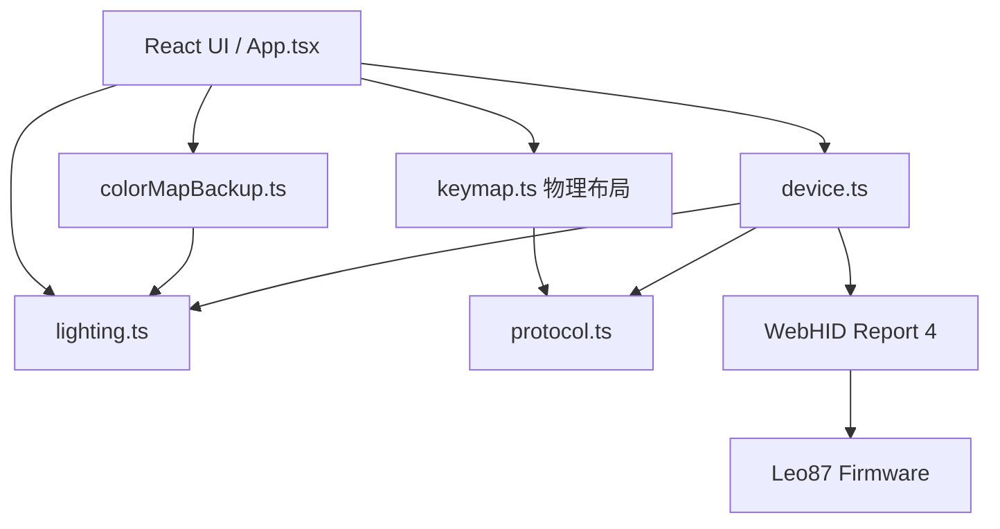

## 产品概述

Leo87 Studio 是 GeekElite Leo87 的非官方网页驱动。当前灯光面板只支持「固定常亮灯效 + 颜色 / 亮度 0-4 / RGB 轮换」三项，且灯效与速度字段在报文里写死。本次按 `docs/GeekElite_Leo87_Lighting_Protocol.md` 把灯光面板补全为完整的动画（灯效）设置，并在此基础上新增与键位 record 索引对齐的逐键颜色编辑。

## 核心功能

### 1. 动画（灯效）设置

- 预设灯效选择，覆盖已抓包确认的全部灯效：波浪、彩虹、转圈、光谱、呼吸、常亮、按键反应、涟漪、奔腾、繁星、百花齐放、滚动、大鹏展翅、厚积薄发、雨中漫步、扫描、跑马灯、自定义；未确认的灯效不提供选项，也不在界面出现。
- 速度档位 0-4，默认 1。
- 亮度档位 0-4，与现有行为一致。
- 单色颜色选择 + RGB 轮换开关，分别对应静态色与轮换两种颜色模式。
- 预览卡实时显示当前灯效名称与颜色模式；发送后提示「请观察键盘确认效果」。

### 2. 颜色设置完善（逐键颜色）

- 键位面板顶部新增「改键 / 逐键颜色」模式切换，复用同一张 TKL 键盘图，位置与 record 索引天然一致，不引入另一套键位映射。
- 逐键颜色模式下，键帽以自身颜色呈现已设置的颜色，未设置的键保持默认外观；点击键位在编辑区为该键取色。
- 提供预设色板（红、橙、黄、绿、浅蓝、深蓝、紫、浅紫、粉）与自定义取色器，支持「清除该键颜色」与「全部清除」。
- 写入前展示与「上次已发送」的颜色差异，未变更时禁止重复提交。
- 点击应用时自动先切换到自定义灯效，再一次性完整写入 128 条记录的颜色表，使设置立即生效。
- 颜色表保存在当前浏览器并支持导出 / 导入二进制文件；刷新页面后仍保留。设备端没有对应的读取命令，界面会明确说明颜色表来自本地记录而不是设备回读。

### 3. 安全与一致性

- 继续使用完整事务写入，任何分段最多只写一次，失败即停止并断开，不留下半提交状态。
- 不写入任何未确认字段：未确认的灯效不下发、方向字段不做、颜色表不写单段。

## 技术栈

沿用现有工程，不引入新依赖：

- Vite 7 + React 19 + TypeScript 5.9（`npm run build` 走 `tsc -b && vite build`）
- 测试：Vitest 3（`npm test`）
- 样式：原生 CSS（`src/styles.css`），沿用既有深色绿主题令牌，不引入 UI 组件库
- 设备通道：WebHID，`320F:5055 / FF1C:0092 / Report ID 4`，63 字节 payload + 16 位小端累加校验

## 实现方案

### 总体策略

沿现有分层扩展，不改变既有架构：`protocol.ts` 只负责字节级报文，新增 `lighting.ts` 承载灯效语义与颜色表数据模型（对照 `macro.ts` 的纯函数风格），`device.ts` 负责 HID 生命周期与事务，`App.tsx` 只做状态与工作流，`colorMapBackup.ts` 对照 `backup.ts` / `macroBackup.ts` 做持久化。键位与宏功能完全不受影响。

### 关键取舍

1. **灯效与颜色模式并存**：协议文档已确认 `payload[8] = effect_id`、`payload[12] = 静态/轮换标志`。因此把「RGB 轮换」保留为独立的 `payload[12]` 开关（既有实机验证行为不回退），而不是用灯效预设去替代它。默认灯效取 `常亮`，与当前写死的 `0x06` 行为保持一致，避免升级后默认行为突变。
2. **速度按保守档位实现**：文档将其标为「疑似 speed」且抓包恒为 `0x04`。用户确认实现为 `0-4`、默认 `1`，界面标注该项尚待实机确认；字段位置固定在 `payload[10]`，便于后续单变量实验校准。
3. **未确认灯效不给名字也不下发**：`lighting.ts` 的灯效表不包含未确认 ID，并在下发前做白名单校验，从代码层面堵住「顺手试一下」的路径。
4. **逐键颜色复用 keymap 的物理布局与分段**：`keymap.ts` 的 `KEY_ROWS` 已是唯一一份「物理位置 → record 索引」表（文档明确要求不要用 W70 的 75% 布局）；`protocol.ts` 的 `chunks()` 产出 `56 × 6 + 48`，与文档给出的颜色表分段完全一致，直接复用而不新造分段逻辑。
5. **颜色表为写-only**：设备没有颜色表的读取命令，因此不做回读校验；本地表是唯一事实来源，写入成功后把当前草稿记为「已发送基准」并持久化。界面与文档都明确这一点，不把「发送成功」表述为「设备已确认」。

### 性能与可靠性

- 颜色表为 384 字节定长内存缓冲，逐键读写均为 O(1)（`record × 3`）；差异比较 O(128)，与 keymap 差异预览同量级，无需优化。
- 一次应用固定 9 条报文（Begin + 灯效 + 7 段 + End），与 keymap 七段写入同量级，无 N+1 问题；`exclusive()` 继续保证不会与改键 / 宏操作交叉发送。
- 全部写入路径保持「完整事务 + 失败即断」；颜色表长度在写入前强制校验为 384 字节，非法长度在发包前就拒绝。

## 架构设计

### 模块关系（在既有架构上新增 lighting 链路）



说明：`lighting.ts` 依赖 `protocol.ts`（`withChecksum` / `PAYLOAD_SIZE` / `chunks`），`device.ts` 依赖 `lighting.ts` 与 `protocol.ts`，`protocol.ts` 不反向依赖任何模块，因此不产生循环依赖。

### 数据流

普通灯效：

```text
面板状态(effectId/brightness/speed/mode/color)
  → lightPacket
  → device.setLighting：BEGIN → 0x06 27 报文 → END
  → 提示观察键盘确认
```

逐键颜色：

```text
键盘图点选 record 索引 → 本地 384 字节颜色表(record×3)
  → 差异预览
  → device.setCustomColorMap：BEGIN → 灯效 0x13 → 7 段 0x0B → END
  → 成功后将草稿记为已发送基准并写入 localStorage
```

## 关键代码结构

`src/protocol.ts` 的灯光类型与报文构造扩展为（字段位置严格对应文档 §3）：

```ts
export type LightingMode = 'static' | 'cycle'
export type Lighting = {
  effectId: number    // payload[8]，已确认灯效 ID
  brightness: number  // payload[9]，0-4
  speed: number       // payload[10]，0-4（文档标注疑似 speed）
  mode: LightingMode  // payload[12]，static 0 / cycle 1
  color: Rgb          // payload[13..15]
}
export function lightPacket(lighting: Lighting): Uint8Array
```

`src/lighting.ts`（新增，纯数据处理，不接触浏览器与设备 API）：

```ts
export const CUSTOM_EFFECT_ID = 0x13
export const COLOR_MAP_SIZE = 384
export const COLOR_RECORD_SIZE = 3
export const COLOR_MAP_COMMAND = 0x0b
export const EFFECT_OPTIONS: ReadonlyArray<{ id: number; label: string }>
export const PRESET_COLORS: ReadonlyArray<{ label: string; hex: string }>
export function assertEffectId(id: number): void
export function colorMapPacket(offset: number, data: Uint8Array): Uint8Array
export function validateColorMap(bytes: Uint8Array): void
export function colorAt(map: Uint8Array, index: number): Rgb
export function withRecordColor(map: Uint8Array, index: number, color: Rgb): Uint8Array
export function diffColorMap(before: Uint8Array, after: Uint8Array): Array<{ index: number; before: Rgb; after: Rgb }>
export function parseHexColor(hex: string): Rgb
export function hexColor(color: Rgb): string
```

`src/device.ts` 新增写入口（顺序即协议文档 §12 的事务）：

```ts
async setCustomColorMap(colorMap: Uint8Array, options: { brightness: number; speed: number }): Promise<void>
```

## 实现注意

- `lightPacket` 的签名从 `{ color, brightness, rainbow }` 变为 `{ effectId, brightness, speed, mode, color }`，`App.tsx` 的 `applyLighting` 与 `protocol.test.ts` 的实机样例断言必须同步更新，`rainbow` 布尔量改为 `mode: 'static' | 'cycle'`；样本断言里 `payload[8]` 由固定 `0x06` 变为所选灯效、`payload[10]` 由固定 `0x04` 变为 `speed`，其余字节（含 `payload[27] = 0xff`、`payload[36] = 0x01`）保持不变。
- 命名冲突：`0x0B` 既是灯效 ID（百花齐放）又是自定义颜色表的命令字，常量命名必须区分（如 `EFFECT_OPTIONS` 中的条目 vs `COLOR_MAP_COMMAND`），不要合并成一个常量。
- 颜色表写入不做回读校验，界面文案统一使用「指令已发送，请观察键盘确认效果」，不得表述为设备已确认。
- 逐键颜色模式下必须屏蔽改键相关的暂存与宏绑定入口，反之亦然，避免用户在两个模式间产生「点了没反应」的误解；切换模式时保留各自草稿。
- 颜色表持久化沿用 `localStorage` + JSON 数组 + 长度与字节范围校验的既有写法，读取失败返回空表而不抛错；导入文件必须恰好 384 字节。
- 复用既有通知机制（`operate(label, action, writing)`）与 `busy` 状态；颜色表写入失败时同样走「断开设备并提示重新读取」的既有分支。
- 不触碰 keymap / 宏的读取、写入与验证流程；`docs/` 下的协议笔记只读不改。

## 目录结构

```
leo87driver/
├── src/
│   ├── protocol.ts            [MODIFY] 公共协议层。扩展 Lighting 类型为 effectId/brightness/speed/mode/color；lightPacket 改为按 payload[8]=effectId、payload[9]=brightness、payload[10]=speed、payload[12]=mode、payload[13..15]=RGB 构造，保持既有校验和与固定字段；新增合法值校验（亮度和速度 0-4、灯效字节范围）。
│   ├── lighting.ts            [NEW] 灯光语义与颜色表数据模块（对照 macro.ts 的纯函数风格，不依赖浏览器/设备 API）。内容：已确认灯效表（不含未确认项）与 assertEffectId 白名单校验；亮度/速度范围常量；预设色板常量；384 字节颜色表的 colorAt / withRecordColor / clearRecordColor / clearColorMap / validateColorMap / diffColorMap；0x0B 分段报文 colorMapPacket（结构：校验和 LE、0x0B、length、offset LE、0x00、数据）；parseHexColor / hexColor 工具（从 App.tsx 迁移）。
│   ├── device.ts              [MODIFY] 设备通信层。setLighting 在发送前做灯效白名单校验；新增 setCustomColorMap(colorMap, { brightness, speed })，在单个 exclusive 事务内按 BEGIN → 自定义灯效报文 → 7 段 0x0B → END 发送，写入前校验 384 字节，不做回读。
│   ├── colorMapBackup.ts      [NEW] 颜色表持久化（对照 backup.ts / macroBackup.ts）。localStorage 存储当前工作表（JSON { bytes, createdAt }，读取时校验长度与字节范围，失败返回 null）；saveColorMap / loadColorMap 覆盖写入式保存；downloadColorMap 导出 .bin；importColorMapFile 校验恰好 384 字节后返回字节。
│   ├── App.tsx                [MODIFY] 灯光面板与键盘面板的状态与工作流。灯光：新增 effectId(默认常亮)/speed(默认 1)/colorMode 状态，改造 applyLighting，灯效预设网格、速度滑块、预览卡文案随灯效变化。键盘：新增「改键 / 逐键颜色」模式状态、颜色表草稿与已发送基准、选中键取色、预设色板与自定义取色器、清除该键 / 全部清除、差异预览、应用逐键颜色（调用 setCustomColorMap）、以及颜色表的本地保存与导入导出入口。模式切换时保留各自草稿并复用既有 operate/busy/notice 机制。
│   ├── styles.css             [MODIFY] 新增灯效预设网格与选中态、速度滑块、面板模式切换控件、键帽颜色呈现、色板与取色器、颜色差异行的样式；全部复用既有主题令牌与字体，不修改既有选择器语义。
│   ├── protocol.test.ts       [MODIFY] 同步 lightPacket 新签名与实机样例断言（payload[8]/[10] 随参数变化，其余字节不变），补充灯效与速度的取值范围校验用​​例。
│   ├── lighting.test.ts       [NEW] 单元测试。覆盖：灯效表不含未确认项且 assertEffectId 对其拒绝；颜色表 0x0B 分段报文头与文档样例逐字节一致（含末段长度）；record×3 偏移的读写与越界拒绝；validateColorMap 长度校验；diffColorMap 差异数量与内容；预设色板十六进制往返解析。
│   └── device.test.ts         [MODIFY] 在既有 FakeDevice 模拟器上新增用例：setCustomColorMap 发出的命令序列为 BEGIN → 灯效报文 → 7 段 0x0B → END，各段长度与 offset 正确，且不夹杂 keymap 或宏命令；非法长度在发包前被拒绝；发送中途失败时不发送结束帧。
├── README.md                  [MODIFY] 灯光说明改为灯效 + 逐键颜色；补充自定义灯效联动、颜色表仅本地留存与无回读的事实。
├── CHANGELOG.md               [MODIFY] 在 Unreleased 的 Added / Changed 下记录灯效设置与逐键颜色功能、速度字段待确认状态。
└── docs/ARCHITECTURE.md       [MODIFY] 架构图与模块职责中加入 lighting.ts 与 colorMapBackup.ts，补充灯光与逐键颜色的数据流说明。
```

## 设计定调

沿用现有深色绿主题与既有版式（顶部导航、01/02/03 编号区块、面板卡片、页脚），本次只在既有面板内新增区块，不重做视觉体系。新增控件的颜色、圆角、边框、禁用态全部取自现有令牌，保证新旧区块在同一个界面里不突兀。

## 页面与区块规划

单页工作台，沿用现有分区，本次改动集中在 01 灯光控制与 02 键位配置。

**01 灯光控制面板**

- 面板头：沿用面板图标 + 编号徽标，标题改为「灯光与动画」。
- 灯效预设网格：3 列自适应网格，每个 chip 显示灯效名称，选中态用主题绿描边加柔和外发光；未确认的灯效不出现在网格中。
- 速度档位滑块：与亮度滑块同一套外观，右侧显示「当前档位 / 4」，并附一行「该档位待实机确认」的小字说明。
- 亮度档位滑块：保持现有 0-4 与「关闭 / 最亮」端点标签。
- 颜色与模式：颜色选择器 + RGB 轮换开关，与灯效预设并列时用细分割线与说明文字区分两类参数。
- 预览卡：主标题随选中灯效名称变化，副标题显示「静态色 / RGB 轮换」，光晕随所选颜色渐变。
- 应用按钮：沿用面板主按钮，发送后沿用现有通知条提示观察键盘。

**02 键位配置面板**

- 面板头新增模式切换：两个等宽分段按钮「改键 / 逐键颜色」，选中态用主题绿底与深色文字，切换时保留各自草稿。
- 键盘图：逐键颜色模式下键帽直接以该键颜色呈现，未设置颜色的键保持默认；已设置颜色的键与选中键有清晰的描边区分。
- 颜色编辑区：显示当前选中键的名称与 record 编号，一行预设色板（圆形色点，选中态有外环），一行自定义取色器与原值对照，以及「清除该键颜色 / 全部清除」按钮。
- 差异预览：沿用既有卡片样式，逐行显示改动键位与颜色新旧值，空态给出引导文案。
- 写入区：应用按钮旁标注「将自动切换到自定义灯效」，并说明颜色表只保存在本浏览器、设备无回读。

## Agent Extensions

### Skill

- **tabbit**
- Purpose: 在实现完成后启动本地开发服务器，用浏览器打开页面并截图，核对新增的灯效预设网格、速度档位、模式切换与逐键颜色编辑区的渲染与布局是否正常（无设备状态下页面应可正常渲染，连接态行为由单元测试覆盖）。
- Expected outcome: 得到灯光面板与逐键颜色模式的截图证据，确认无布局错位、无运行时错误、新旧区块风格一致；若发现渲染问题则反馈并修正后复验。