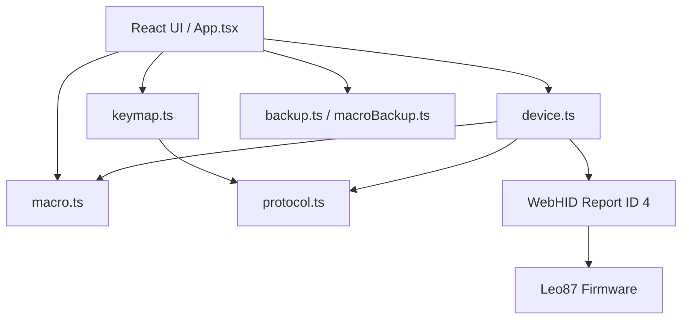

# Leo87 Studio 架构说明

## 1. 项目目标

Leo87 Studio 是运行在桌面 Chrome 或 Edge 中的非官方网页驱动。浏览器通过 WebHID 直接访问 GeekElite Leo87 的厂商配置接口，所有配置数据仅在网页、浏览器本地存储和键盘之间流动。

当前主要能力包括：

- 连接和识别 Leo87 配置接口；
- 灯光设置；
- 读取、展示和完整写回 keymap；
- 键位、滚轮和媒体动作配置；
- keymap 与宏数据的本地备份和恢复；
- 板载宏读取、录制、编辑、写回和按键绑定。

## 2. 技术结构



项目使用 Vite 构建，React 负责界面和编辑状态，TypeScript 协议模块负责字节级编码与校验，设备层负责 WebHID 生命周期、收发等待和事务互斥。

## 3. 模块职责

### `src/protocol.ts`

负责公共 HID 常量和 keymap、灯光协议：

- 63 字节 payload 与 16 位小端累加校验和；
- Begin、End、Current Config 报文；
- 灯光报文；
- `0x07`、`0x08` keymap 读取；
- `0x09` keymap 写入；
- 384 字节 keymap 和 3 字节 record 的读取、替换与差异比较。

### `src/macro.ts`

负责板载宏的纯数据处理：

- `0x14` GET 和 `0x15` SET 分段报文；
- 宏 Header、offset table、10 个变长 entry 的解析；
- 普通键盘宏动作的序列化；
- 修改单个宏后重建全部 offsets 和 `used_end`；
- `0x70` 普通宏触发与 `0x71` 重复次数触发；
- 浏览器 `KeyboardEvent.code` 到 USB HID usage 的有限映射。

该模块不直接访问设备或浏览器 API，便于用固定字节样本测试。

### `src/device.ts`

负责 WebHID 设备通信：

- 筛选 `VID 0x320F / PID 0x5055 / Usage Page 0xFF1C / Usage 0x0092`；
- 打开、关闭及断连处理；
- 保证同一时间只执行一个 HID 操作；
- 为每个读写请求注册临时 `inputreport` 监听器和超时；
- 忽略与当前等待命令无关的 ACK；
- 校验响应命令、长度、offset 和回显数据；
- 完整执行 keymap 与宏的读取、写入和回读验证。

### `src/keymap.ts`

负责用户可选动作、键盘物理布局和 record 的人类可读描述。宏 trigger 也在这里转换成 `M1 · 正常停止` 等界面文本。

### `src/backup.ts` 与 `src/macroBackup.ts`

分别保存首次成功读取的 keymap 和宏数据。备份存放于当前站点的 `localStorage`，并支持导出为二进制文件。

### `src/App.tsx`

负责页面状态和工作流：

- 设备连接、重新读取和断开；
- 灯光表单；
- 键位选择、暂存、差异预览和写入；
- M1–M10 选择、实时录制、延时修改和保存；
- 宏触发绑定；
- keymap 与宏的导入、导出和恢复；
- 将宏读取错误限制在宏区域，不影响键位和灯光。

## 4. 关键数据流

### 连接与读取

1. 用户主动调用 `navigator.hid.requestDevice()`。
2. 打开匹配的 Leo87 配置接口。
3. 使用 `Begin → Current Config → 7 × 0x08 → End` 读取当前 keymap；失败时回退到 `0x07`。
4. keymap 成功后独立使用 `0x14` 读取宏数据。
5. 宏读取或解析失败只更新宏错误状态，连接和 keymap 保持可用。

### Keymap 写入

1. 所有界面修改只写入内存中的 draft。
2. 写入前展示 record 级差异。
3. 使用 Begin、七段 `0x09`、End 完整写回 384 字节。
4. 新开事务，通过七段 `0x08` 重新读取当前配置。
5. 回读结果用于刷新页面并报告首个差异位置。

### 宏写入

1. 修改单个槽位时，其余槽位沿用原始 entry 字节。
2. 重建 10 个 offsets 和 `used_end`。
3. 写入前使用 `0x14` 探测目标长度范围，增长部分必须预先可读。
4. 使用若干 `0x15` 分段写入，每段等待设备回显 ACK。
5. 完成后重新用 `0x14` 读取并逐字节比较。
6. 宏保存并通过校验后，用户才能把该 draft 宏绑定到 keymap。

## 5. 宏录制模型

宏动作采用以下内存结构：

```ts
type MacroAction = {
  delayMs: number
  pressed: boolean
  usage: number
}
```

序列化后每条动作固定为 4 字节：

```text
delay_ms:uint16 LE
event_type:uint8
hid_usage:uint8
```

- `0x8A` 表示普通键盘按下；
- `0x0A` 表示普通键盘抬起；
- 按下延时最小为 1 ms；
- 抬起延时可为 0 ms；
- 每个槽位最多 90 条动作；
- 首版不录制 Ctrl、Shift、Alt、Win、媒体键、鼠标和未知事件。

## 6. 数据保护原则

- 首次写入前必须存在对应类型的浏览器备份。
- Keymap 和宏使用互相独立的备份、导入、写入与验证流程。
- Keymap 始终完整七段写回，不执行单段提交。
- 宏变长 entry 必须整体重建，不在原 byte array 中直接插入数据。
- 未知 Header、非法 offset、错误 marker、超限 action count 或未知事件会使对应宏进入只读状态。
- 写入中断、超时、错位响应或回读不一致时停止当前工作流。
- 宏写入失败后不会继续提交 keymap 触发绑定。

## 7. 当前协议假设与已知差异

宏解析器目前依据逆向文档采用以下布局：

```text
0x00  AA 55          Magic
0x02  used_end       uint16 LE
0x04  macro_count    uint16 LE，预期为 10
0x10  offsets[10]    uint16 LE
0x24  entries...
```

实机已出现与该布局不一致的数据：一次读取的 `used_end` 为 `0x001A`，另一次读取中 M1 offset 指向的位置没有 `35 00` marker。当前实现会拒绝解析和写入这类数据。这一保护行为是有意设计，后续需要完整保存 `0x14` 响应并补充实际 Header 布局后再扩展兼容。

## 8. 测试结构

- `protocol.test.ts`：灯光、校验和、keymap 分段和 record 操作。
- `keymap.test.ts`：键位描述、滚轮、媒体动作和宏触发显示。
- `macro.test.ts`：文档 M2 样本、entry 序列化、offset 重排、90 条限制和触发 record。
- `device.test.ts`：模拟 HID 设备上的读取、完整写入、ACK、超时、错位响应、写入中断和回读不一致。

常用验证命令：

```powershell
npm test
npm run build
```
