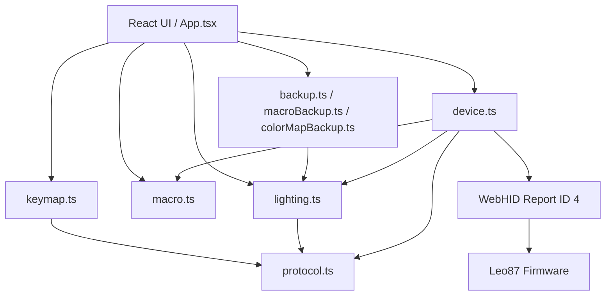

# Leo87 Studio 架构说明

## 1. 项目目标

Leo87 Studio 是运行在桌面 Chrome 或 Edge 中的非官方网页驱动。浏览器通过 WebHID 直接访问 GeekElite Leo87 的厂商配置接口，所有配置数据仅在网页、浏览器本地存储和键盘之间流动。

当前主要能力包括：

- 连接和识别 Leo87 配置接口；
- 灯效（动画）与逐键颜色设置；
- 读取、展示和完整写回 keymap；
- 键位、滚轮和媒体动作配置；
- keymap 与宏数据的本地备份和恢复；
- 板载宏读取、录制、编辑、写回和按键绑定。

## 2. 技术结构



项目使用 Vite 构建，React 负责界面和编辑状态，TypeScript 协议模块负责字节级编码与校验，设备层负责 WebHID 生命周期、收发等待和事务互斥。

## 3. 模块职责

### `src/protocol.ts`

负责公共 HID 常量和 keymap、灯光报文：

- 63 字节 payload 与 16 位小端累加校验和；
- Begin、End、Current Config 报文；
- 灯效（灯光）报文：`payload[8] = effectId`、`[9] = brightness`、`[10] = speed`（数值越小越快：0 最快、4 最慢）、`[12] = mode`、`[13..15] = RGB`，并校验亮度与速度的 0–4 档位；
- `0x07`、`0x08` keymap 读取；
- `0x09` keymap 写入；
- 384 字节 keymap 和 3 字节 record 的读取、替换与差异比较。

### `src/lighting.ts`

负责灯光语义与逐键颜色表的纯数据处理（对照 `macro.ts` 的风格，不接触设备与浏览器 API）：

- 实机确认过的灯效表 `EFFECT_OPTIONS`（`0x11` 不在表中）与下发前的白名单校验 `assertEffectId`；
- 预设色板 `PRESET_COLORS`、`parseHexColor` / `hexColor`；
- `0x0B` 逐键颜色表分段报文 `colorMapPacket`；
- 384 字节颜色表的 `colorAt` / `withRecordColor` / `clearRecordColor` / `clearColorMap` / `diffColorMap` / `coloredRecordCount`；
- 颜色表 record 索引与 keymap 完全一致，偏移为 `record × 3`，因此可以直接复用 `keymap.ts` 的物理布局。

### `src/macro.ts`

负责板载宏的纯数据处理：

- `0x14` GET 和 `0x15` SET 分段报文；
- 宏 Header（`magic / used_end / entry_count / reserved`）、长度随 `entry_count` 变化的 offset table，以及变长 entry 的解析；
- 普通键盘宏动作的序列化；
- 修改单个槽位后重建 `entry_count`、全部 offsets 和 `used_end`；目标槽位尚未序列化时按空 entry 补齐；
- 布局不符时抛出 `MacroLayoutError`，携带原始探测样本，并由 `inspectMacroHeader` 生成只读诊断报告（Header 字段、offset table 与每个 entry 的 marker / action_count、hexdump）；
- `0x70` 普通宏触发与 `0x71` 重复次数触发；
- 浏览器 `KeyboardEvent.code` 到 USB HID usage 的有限映射。

该模块不直接访问设备或浏览器 API，便于用固定字节样本测试。

### `src/device.ts`

负责 WebHID 设备通信：

- 筛选 `VID 0x320F / PID 0x5055 / Usage Page 0xFF1C / Usage 0x0092`；
- 打开、关闭及断连处理；
- 保证同一时间只执行一个 HID 操作；
- 为每个读写请求注册临时 `inputreport` 监听器和超时；
- 忽略与当前等待命令无关的 ACK；
- 校验响应命令、长度、offset 和回显数据；
- 完整执行 keymap 与宏的读取、写入和回读验证；
- 发送灯效报文（`setLighting`，下发前做灯效白名单校验）与逐键颜色表（`setCustomColorMap`）。

### `src/keymap.ts`

负责用户可选动作、键盘物理布局和 record 的人类可读描述。宏 trigger 也在这里转换成 `M1 · 正常停止` 等界面文本。

### `src/backup.ts`、`src/macroBackup.ts` 与 `src/colorMapBackup.ts`

分别保存首次成功读取的 keymap、首次成功读取的宏数据，以及逐键颜色表的工作副本。三者都存放于当前站点的 `localStorage`，并支持导出为二进制文件。

颜色表的差别在于设备没有对应的读取命令，所以 `colorMapBackup` 保存的不是“首次读取备份”，而是当前工作表：它在每次成功发送逐键颜色后才写入，导入文件必须是正好 384 字节。

宏模块额外提供不经过布局校验的导出：`downloadRawMacro` 保存设备真实回送的原始转储，`downloadMacroReport` 保存诊断报告文本；只有 `downloadMacro` 会对字节做完整校验。这样在布局尚未确认时也能留证据，同时不给写入路径开口子。

### `src/App.tsx`

负责页面状态和工作流：

- 设备连接、重新读取和断开；
- 灯光表单：灯效网格、亮度与速度档位、颜色与 RGB 轮换；
- 键位面板的「改键 / 逐键颜色」模式切换、逐键取色、差异预览、应用与颜色表导入导出；
- 键位选择、暂存、差异预览和写入；
- M1–M10 选择、实时录制、延时修改和保存；
- 宏触发绑定；
- keymap 与宏的导入、导出和恢复；
- 将宏读取错误限制在宏区域，不影响键位和灯光。

## 4. 关键数据流

### 连接与读取

1. 用户主动调用 `navigator.hid.requestDevice()`。
2. 打开匹配的 Leo87 配置接口。
3. 使用 `Begin → Current Config → 7 × 0x08 → End` 读取当前 keymap；失败时回退到 `0x07`。
4. keymap 成功后独立使用 `0x14` 读取宏数据。
5. 宏读取或解析失败只更新宏错误状态，连接和 keymap 保持可用；同时保留设备真实回送的样本（布局错误为 56 字节探测窗口，解析错误为整段数据）并生成诊断报告，供导出与后续分析。

### 灯效与逐键颜色

1. 普通灯效只发送一条配置报文：`Begin → 0x06 27（effectId / brightness / speed / mode / RGB）→ End`，由键盘 MCU 自行生成动画。
2. 逐键颜色在普通灯效之上多一层：颜色表是 384 字节 = 128 record × 3 字节，record 索引与 keymap 一致。
3. 点击“应用到键盘”时使用同一个事务：`Begin → 自定义灯效 0x13 → 7 段 0x0B → End`，任一分段失败即中止且不发送结束帧。
4. 设备没有颜色表的读取命令，因此不做回读校验；成功发送后把草稿记为“已发送基准”并写入本地工作表，界面文案只承诺“报文已发出”。

### Keymap 写入

1. 所有界面修改只写入内存中的 draft。
2. 写入前展示 record 级差异。
3. 使用 Begin、七段 `0x09`、End 完整写回 384 字节。
4. 新开事务，通过七段 `0x08` 重新读取当前配置。
5. 回读结果用于刷新页面并报告首个差异位置。

### 宏写入

1. 修改单个槽位时，其余槽位沿用原始 entry 字节；已存在的 entry 不会被重新编号，也不会因为清空而删除。
2. 目标槽位超出当前 `entry_count` 时按空 entry（`00 00 35 00`）补齐，再重建 `entry_count`、offset table 与 `used_end`。
3. 写入前使用 `0x14` 探测目标长度范围，增长部分必须预先可读。
4. 使用若干 `0x15` 分段写入，每段等待设备回显 ACK。
5. 完成后重新用 `0x14` 读取并逐字节比较。
6. 宏保存并通过校验后，用户才能把该 draft 宏绑定到 keymap。

## 5. 宏录制模型

宏动作采用以下内存结构：

```ts
type MacroAction = {
  delayMs: number
  pressed: boolean
  usage: number
}
```

序列化后每条动作固定为 4 字节：

```text
delay_ms:uint16 LE
event_type:uint8
hid_usage:uint8
```

- `0x8A` 表示普通键盘按下；
- `0x0A` 表示普通键盘抬起；
- 按下延时最小为 1 ms；
- 抬起延时可为 0 ms；
- 每个槽位最多 90 条动作；
- entry 头为 `<action_count:uint16> 35 00`，storage 的拼装规则见第 7 节；
- 首版不录制 Ctrl、Shift、Alt、Win、媒体键、鼠标和未知事件。

### 键位解析

录制时把浏览器键盘事件解析成 HID usage，入口是 `resolveKeyUsage`，按三级降级：

```text
KeyboardEvent.code（标准来源，最可靠）
  → KeyboardEvent.keyCode（部分内嵌浏览器 / 虚拟键盘不填 code 时的旧式来源）
  → KeyboardEvent.key（单个字母或数字，不区分大小写）
  → 未映射
```

之所以不只依赖 `code`：只要 `code` 为空，整类按键（字母、数字）都会一起失效，而 `keyCode` / `key` 还能把它们救回来。只有三条路径都命中不了才判定未映射。

`keyCode = 229` 是输入法组合输入的标志。中文输入法会截走字母键的 `keydown`（`key = 'Process'`、`keyCode = 229`、没有可用的 `code`），只把带着真实键位的 `keyup` 放行；数字键则直接透传，两件事都正常。这正是“数字能录、字母录不进去”的原因。录制中会监听 `compositionstart` 并提示切到英文输入。

### 只剩抬起事件时的敲击补录

当某个 `keyup` 的 usage 没有对应的按下记录时，说明环境吞掉了 `keydown`。此时按一次敲击补录两条动作（`synthesizeTapActions`）：

```text
按下：delay = 距上一条动作的间隔（最小 1 ms）
抬起：delay = 本次不可用 keydown 到 keyup 的间隔（没有则为 0）
```

补录只保证“能录进去”，不还原真实按住时长，也不支持组合键；横幅会明确标注处于补录状态。要录到真实时序，需在英文输入法下录制。

### 录制监视

录制期间不存在静默忽略分支。每次按键都会更新监视条与事件历史：

- `按下 / 抬起 / 记录 / 忽略` 四个计数——按下计数为 0 就说明 `keydown` 根本没到页面，而不是被规则拦下；
- 最近一次事件的原始 `code / key / keyCode`、解析结果与解析路径；
- 忽略原因：未映射、该键已在按下状态、已达 90 条上限；
- 可展开的“最近 8 个键盘事件”，每行带方向、原始字段、结果与 `repeat`、`composing` 标记。

这样“按键没反应”能立刻区分为三类：事件没到页面（计数不增长）、按下被输入法截走（只增长抬起、且出现补录）、收到但被规则忽略（原因可见）。

## 6. 数据保护原则

- 首次写入前必须存在对应类型的浏览器备份。
- Keymap 和宏使用互相独立的备份、导入、写入与验证流程。
- Keymap 始终完整七段写回，不执行单段提交。
- 宏变长 entry 必须整体重建，不在原 byte array 中直接插入数据。
- 未知 Header、非法 offset、错误 marker、超限 action count、`entry_count` 越界或未知事件都会阻止对应数据的解析与写入。
- 写入中断、超时、错位响应或回读不一致时停止当前工作流。
- 宏写入失败后不会继续提交 keymap 触发绑定。

## 7. 宏存储结构与约束

宏存储的实际布局：

```text
0x00  AA 55               magic
0x02  used_end            uint16 LE，storage 结束位置
0x04  entry_count         uint16 LE，当前序列化的 entry 数量（1–10）
0x06  reserved            10 字节
0x10  offsets[entry_count] uint16 LE，长度 = entry_count × 2
entries...                每个 entry 起于对应 offset
```

每个 entry：

```text
offset + 0x00  action_count  uint16 LE
offset + 0x02  marker 0x0035 uint16 LE
offset + 0x04  actions[action_count]，每条 4 字节
entry_size = 4 + action_count × 4
```

由此得到一条闭环约束，解析时逐项校验：

```text
used_end = 0x10 + entry_count × 2 + Σ (4 + action_count × 4)
```

- `M1–M10` 是键位可绑定的槽位容量，第 i 个 entry 对应 M(i+1)；
- storage 不保证序列化 10 个 entry，`entry_count` 由设备当前保存的内容决定；
- 编辑器把 `index ≥ entry_count` 的槽位显示为“尚未序列化”，保存时才补建空 entry；
- 多个 entry 的 offset 必须单调递增，第一个 offset 必须 ≥ `0x10 + entry_count × 2`；
- 最后一个 entry 的声明长度必须正好落到 `used_end`。

只要 `macroUsedEnd` 的 magic / `used_end` 范围检查失败，或 `parseMacroStorage` 的上述任一校验失败，页面就拒绝解析与写入，同时保留原始样本与诊断报告。

> 历史备注：早期实现把 entry 头误读为 `35 00 <action_count>`，并把 `0x04` 当成固定值 10，
> 导致实机 `entry_count = 1`、`used_end = 0x001A` 的正常 storage 被判为损坏。
> 结构修正后这两个「异常」都成为合法数据的实证，详见 `docs/GeekElite_Leo87_Macro_Protocol.md` §3、§4、§8.1。

## 8. 测试结构

- `protocol.test.ts`：灯效报文（含实机红色样例）、校验和、keymap 分段和 record 操作。
- `lighting.test.ts`：灯效表与 `0x11` 白名单、亮度/速度档位、`0x0B` 分段报文与笔记样例头、record × 3 偏移、清除与差异、`#RRGGBB` 往返。
- `keymap.test.ts`：键位描述、滚轮、媒体动作和宏触发显示。
- `macro.test.ts`：实机 `entry_count = 1` 样本、10 entry 完整表、entry 头字段顺序、entry 序列化、offset 与 `used_end` 重算、槽位补建、90 条限制、触发 record、诊断报告，以及键位三级降级解析（含 `keyCode = 229` 的输入法场景与监视文本）。
- `device.test.ts`：模拟 HID 设备上的读取、完整写入、ACK、超时、错位响应、写入中断、回读不一致、`used_end` 越界时保留探测样本且不发送任何 `0x15`，以及逐键颜色的事务顺序、强制 `0x13` 灯效、长度非法不发报文与中途失败不发结束帧。

常用验证命令：

```powershell
npm test
npm run build
```
